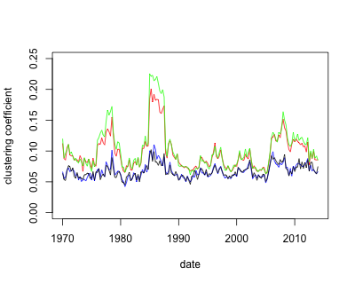
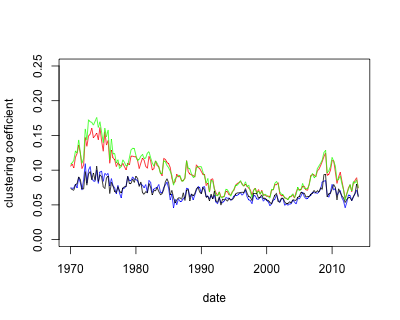
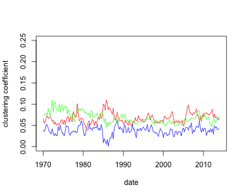
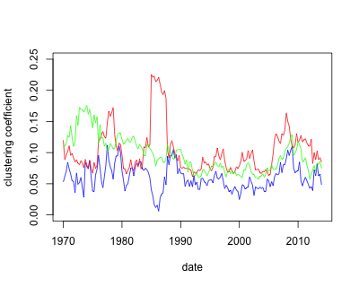
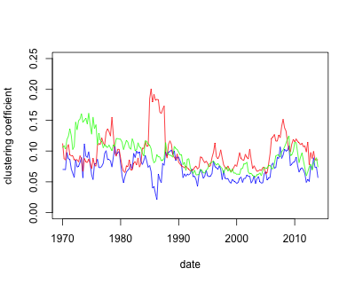
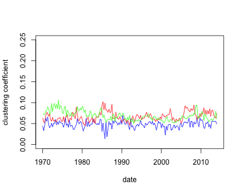

[](http://quantlet.de/)

## [](http://quantlet.de/) **INET-cluster** [](http://quantlet.de/)

```yaml


Name of QuantLet: INET-cluster

Published in: Industry Interdependency Dynamics in a Network Context

Description: 'Calculate the whole sample and moving window network clustering coefficients of industry portfolios'

Keywords: 'clustering coefficient, network, cycle, middleman, in, out'

Author: Ya Qian

Submitted: Ya Qian

Datafile: whole sample and moving window beta files

Output: clustering measures and time series plots

```












