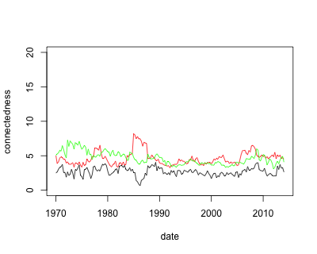

[](http://quantlet.de/)

## [](http://quantlet.de/) **INET-connectedness** [](http://quantlet.de/)

```yaml


Name of QuantLet: INET-connectedness

Published in: Industry Interdependency Dynamics in a Network Context

Description: 'Calculate the whole sample and moving window network connectedness of industry portfolios'

Keywords: 'connectedness, network, tail risk, interdependency, dynamic'

Author: Ya Qian

Submitted: Ya Qian

Datafile: whole sample and moving window beta files

Output: connectedness measures and time series plots

```



### R Code
```r

#Close windows and clear variables                                                                   
graphics.off()
rm(list = ls(all=TRUE))

# install and load packages
libraries = c("fields", "graphics", "stats", "Matrix", "ggplot2")
lapply(libraries, function(x) if (!(x %in% installed.packages())) {
  install.packages(x)})
lapply(libraries, library, quietly = TRUE, character.only = TRUE)

#whole sample connectedness
datafile                     = c("beta_L_median.csv", "beta_L_lowertail.csv","beta_L_uppertail.csv")
conn_tot                     = matrix(0,1,3)
for (s in 1:length(datafile)){
  conn_total                 = read.csv(datafile[s], header = TRUE, sep = ",", dec = ".")
  industrynames              = read.csv("industrynames.csv")
  conn_total                 = conn_total [ ,-1]
  rownames(conn_total)       = industrynames[ ,2]
  colnames(conn_total)       = industrynames[ ,2]
  adjac                      = data.matrix(conn_total)
  diag(adjac)                = 0
  adjac                      = abs(adjac)
  adjac                      = t(adjac)
  conn_tot[,s]               = sum(adjac)/49
}
  
#moving window connectedness
datafile_mw                  = c("mw/beta_L_median ", "mw/beta_L_lowertail ", "mw/beta_L_uppertail ")
industrynames                = read.csv("industrynames.csv")
conn_mw                      = matrix(0,177,3)
for (i in 1:length(datafile_mw)){
  for (s in 1:177){
    datafile                 = paste(datafile_mw[i], s, " .csv", sep ="")
    networkcoeff             = read.csv(datafile, header = TRUE, sep = ",", dec = ".")
    networkcoeff             = networkcoeff[ ,-1]
    rownames(networkcoeff)   = industrynames[ ,2]
    colnames(networkcoeff)   = industrynames[ ,2]
    adjac                    = data.matrix(networkcoeff)
    diag(adjac)              = 0
    adjac                    = abs(adjac)
    adjac                    = t(adjac)
    conn_mw[s,i]             = sum(adjac)/49
  }
}
colnames(conn_mw)            = c('melevel','lolevel', 'uplevel')
dateindex                    = seq(as.Date("1970/1/1"), as.Date("2014/1/1"), "quarters")
conn_mw                      = as.data.frame(conn_mw)
rownames(conn_mw)            = dateindex
write.csv(conn_mw, file = "conn_mw.csv")

png(file="connect.png",width = 400, height=320, bg = NA)
plot(dateindex, conn_mw$melevel, col = 'black', type ='l', ylim = c(0,20), ylab = 'connectedness', xlab = 'date')
lines(dateindex, conn_mw$lolevel, col = 'red')
lines(dateindex, conn_mw$uplevel, col = 'green')
#ggplot(data = conn_mw, aes(x = dateindex)) + 
 #      geom_line(aes(y = melevel)) + 
  #     geom_line(aes(y = lolevel)) +
   #    geom_line(aes(y = uplevel)) +
    #   scale_color_manual(values = c('black', 'red', 'darkgreen'))+
     #  labs(y = "connectedness")


#plot the time series of connectedness
#conn_mw_ts                    = ts(conn_mw, start=c(1970, 01), end=c(2014, 01), frequency=12)
#png(file="out.png",width = 400, height=320, bg = NA)
#ts.plot(conn_mw_ts, gpars= list(col=c("blue", "red", "darkgreen"))) # connect
dev.off()
```

automatically created on 2018-05-28