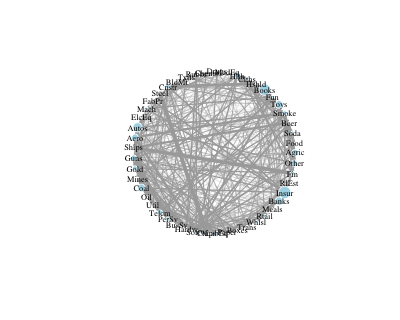
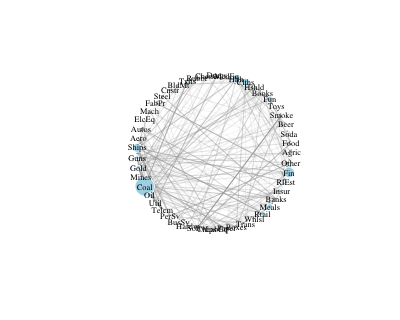
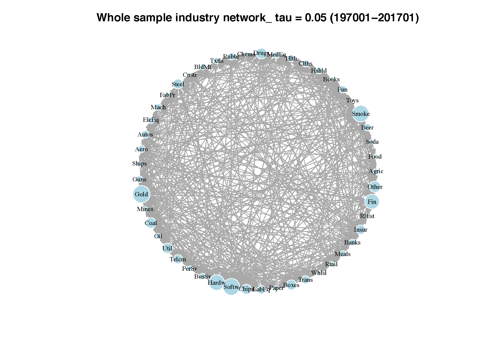
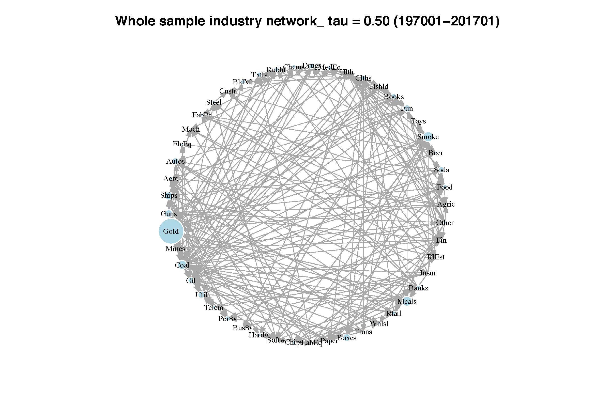
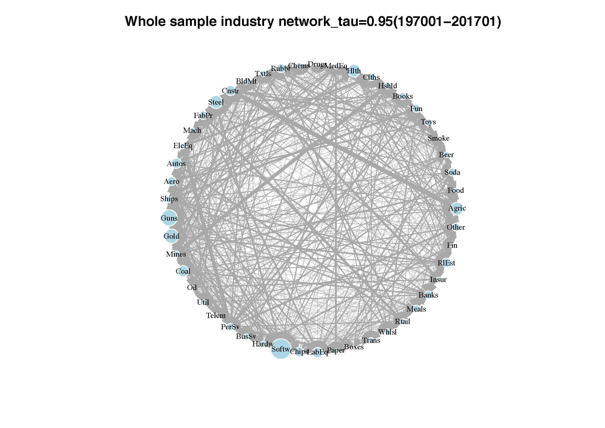
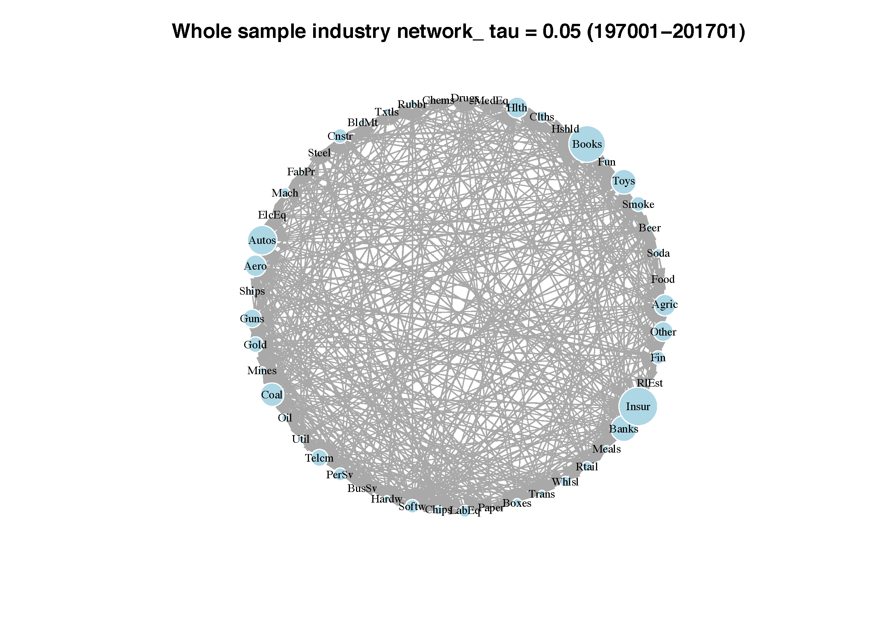
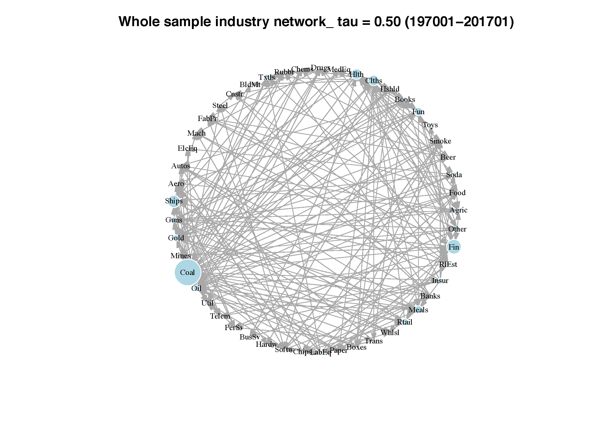
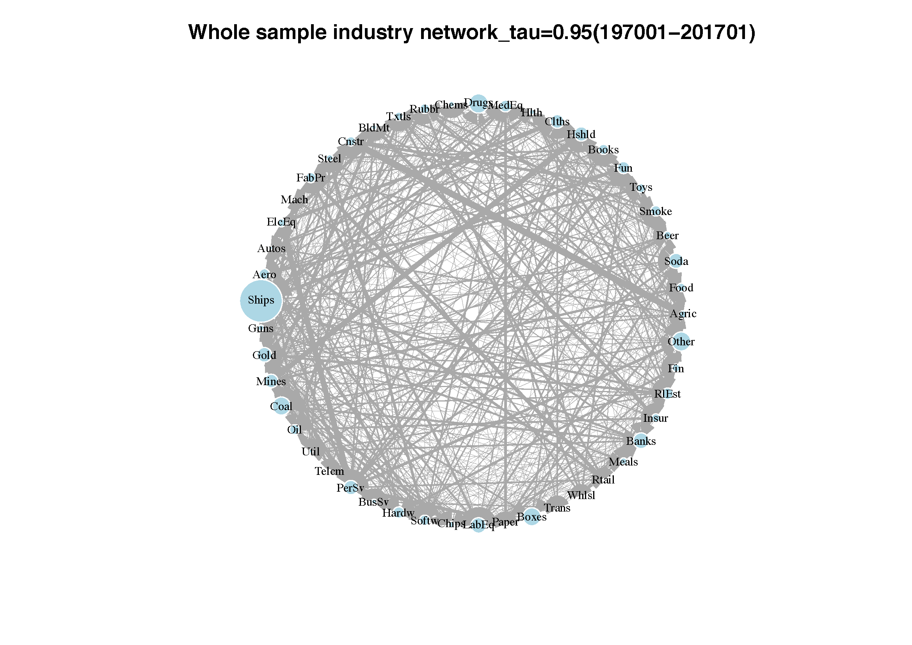
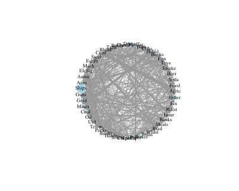

[](http://quantlet.de/)

## [](http://quantlet.de/) **INET-totalnet** [](http://quantlet.de/)

```yaml


Name of QuantLet: INET-totalnet

Published in: Industry Interdependency Dynamics in a Network Context

Description: 'Plot the interdependency networks of the return data of 49 USA industries                       under different stress situations (median, lowertail and uppertail) with larger size denoting high in or out centrality scores'

Keywords: 'quantile regression, interdependency, network, centrality, stress situation'

Author: Ya Qian

Submitted: Ya Qian

Datafile: 'industryname.csv, beta_L_median.csv, beta_L_lowertail.csv,      beta_L_uppertail.csv'

Output: 'Plots of interdependency networks with centrality denotation under different stress situations (median, lowertail and uppertail)' 

```



















### R Code
```r

#Close windows and clear variables                                                                   
graphics.off()
rm(list = ls(all=TRUE))

# set the working directory
#setwd("/Users/qianya/Library/Mobile Documents/com~apple~CloudDocs/ffdata/test")

# install and load packages
libraries = c("dplyr", "igraph", "stringr")
lapply(libraries, function(x) if (!(x %in% installed.packages())) {
  install.packages(x)})
lapply(libraries, library, quietly = TRUE, character.only = TRUE)

#read datafiles
industrynames          = read.csv("industrynames.csv", header = TRUE, sep = ",")
industrynames          = industrynames[,-1]
#beta_L_median.csv should be replaced with beta_L_lowertail.csv and beta_L_lowertail.csv when different cases are considered 
data0                  = read.csv("beta_L_median.csv", header = TRUE, sep = ",", dec = ".")
data0                  = data0[,-1]
rownames(data0)        = industrynames
colnames(data0)        = industrynames
#cen_out_median.csv and cen_in_median.csv shoule be replaced by cen_out_lowertail.csv and cen_in_lowertail.csv
#or cen_out_uppertail.csv and cen_in_uppertail.csv when different cases are considered
censcore_out           = read.table("cen_out_median.csv", sep = ",", dec = ".")
colnames(censcore_out) = c("name", "censcore")
sorted_censcore_out    = censcore_out[match(rownames(data0), censcore_out$name),]
censcore_in            = read.table("cen_in_median.csv", sep = ",", dec = ".")
colnames(censcore_in)  = c("name", "censcore")
sorted_censcore_in     = censcore_in[match(rownames(data0), censcore_in$name),]
Adjac                  = as.matrix(data0)
Adjac                  = abs(Adjac)
Adjac                  = t(Adjac)
summ = sum(Adjac)/49
rownames(Adjac)        = industrynames
colnames(Adjac)        = industrynames
diag(Adjac) = 0

#plot network with centrality
Graph1                 = graph_from_adjacency_matrix(Adjac, mode = "directed", 
                                                     weighted = TRUE, diag = FALSE, add.colnames = TRUE)
lay                    = layout.circle(Graph1)
V(Graph1)$color        = "lightblue"
E(Graph1)
png(file="uppernet.png",width = 400, height=320, bg = NA)
plot(Graph1, edge.arrow.size=0.1, vertex.size = sorted_censcore_out[,2]*40, vertex.frame.color="#ffffff", vertex.label=colnames(Adjac), 
     vertex.label.cex = 0.7, edge.width = Adjac[Adjac>0]*10, vertex.label.color="black", layout = lay)

eigenscores_out        = censcore_out[order(censcore_out[,2], decreasing = TRUE),]
eigenscores_in         = censcore_in[order(censcore_in[,2], decreasing = TRUE),]
dev.off()
#save the sorted centrality files
#write.table(eigenscores_out, file = "sorted_cen_out_median.txt", sep = "&" )
#write.table(eigenscores_in, file = "sorted_cen_in_median.txt", sep = "&" )


```

automatically created on 2018-05-28